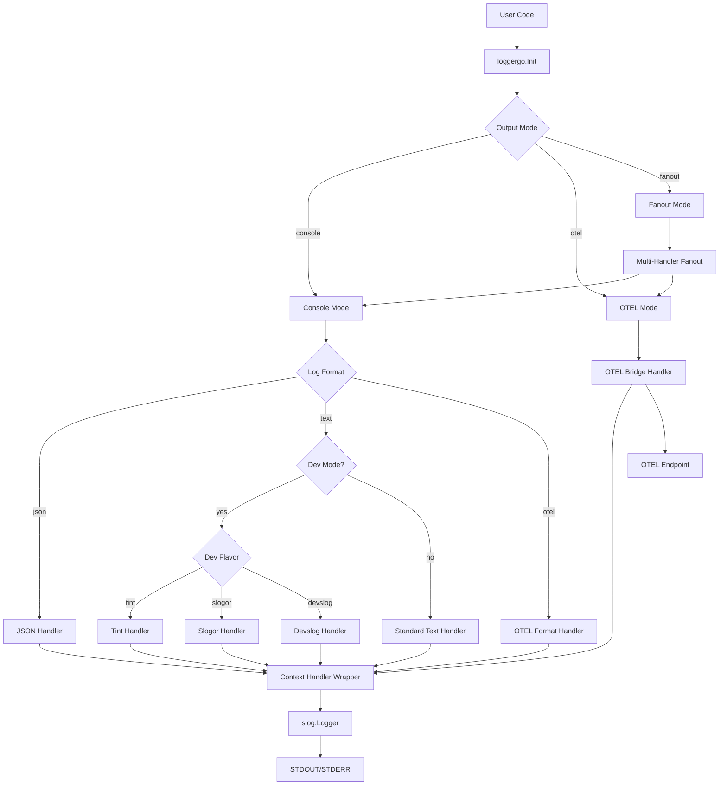
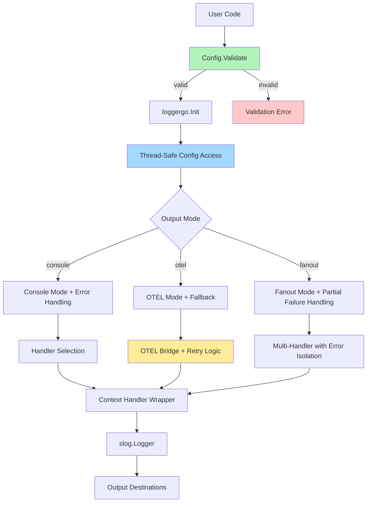
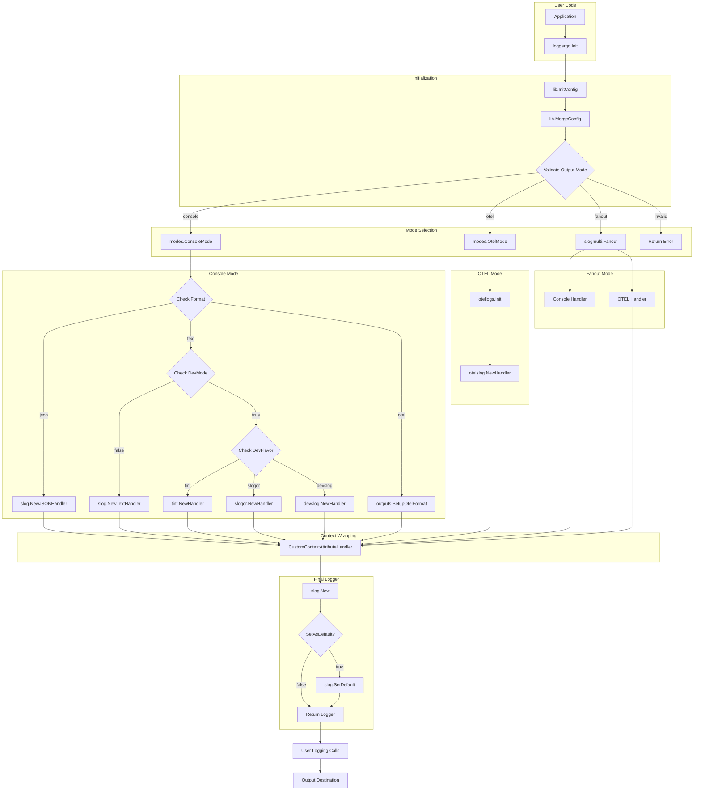

# Design Document

## Overview

This design document outlines improvements to the LoggerGo library based on a comprehensive audit. The library provides structured logging with OpenTelemetry integration, multiple output formats, and context-aware logging. The improvements focus on API usability, configuration validation, error handling, thread safety, backward compatibility, testing, performance, and documentation.

### Current Architecture

LoggerGo is built on top of Go's standard `log/slog` package and provides:
- Multiple output modes (console, OTEL, fanout)
- Multiple log formats (JSON, text, OTEL)
- Development mode with different flavors (tint, slogor, devslog)
- Context-aware logging with automatic value extraction
- OpenTelemetry integration with trace/span ID injection
- Dynamic log level adjustment

### Key Components

1. **Main API** (`logger.go`) - Entry point with `Init()` function
2. **Configuration** (`lib/config.go`, `lib/types/config.go`) - Configuration management
3. **Context Handler** (`context_handler.go`) - Extracts values from context
4. **Modes** (`lib/modes/`) - Console and OTEL output implementations
5. **Outputs** (`lib/outputs/`) - Format-specific handlers (plain, OTEL)
6. **Types** (`lib/types/`) - Type definitions and enums

## Architecture


### Current Architecture Diagram




### Improved Architecture

The improved architecture maintains backward compatibility while adding:

1. **Configuration Validation Layer** - Validates config before initialization
2. **Error Context Enrichment** - Wraps errors with actionable context
3. **Thread-Safe Configuration Access** - Protects shared state
4. **Graceful Degradation** - Fallback behaviors for failures
5. **Resource Management** - Proper cleanup mechanisms




## Components and Interfaces

### 1. Configuration Validation

**New Interface:**
```go
type Validator interface {
    Validate() error
}
```

**Implementation:**
```go
func (c *Config) Validate() error {
    var errs []error
    
    // Validate level
    if c.Level == nil {
        errs = append(errs, fmt.Errorf("Level cannot be nil"))
    }
    
    // Validate output mode
    if c.Output == (OutputType{}) {
        errs = append(errs, fmt.Errorf("Output mode must be specified"))
    }
    
    // Validate OTEL-specific fields
    if c.Output == OutputOtel || c.Output == OutputFanout {
        if c.OtelLoggerName == "" {
            errs = append(errs, fmt.Errorf("OtelLoggerName required for OTEL output"))
        }
        if c.OtelServiceName == "" {
            errs = append(errs, fmt.Errorf("OtelServiceName required for OTEL output"))
        }
    }
    
    // Validate context keys
    if c.ContextKeysDefault != nil && len(c.ContextKeys) == 0 {
        errs = append(errs, fmt.Errorf("ContextKeysDefault set but no ContextKeys defined"))
    }
    
    if len(errs) > 0 {
        return fmt.Errorf("configuration validation failed: %w", errors.Join(errs...))
    }
    
    return nil
}
```


### 2. Thread-Safe Configuration Management

**Current Issue:** Global `libConfig` variable accessed without synchronization

**Solution:**
```go
type configManager struct {
    mu     sync.RWMutex
    config Config
}

var globalConfigManager = &configManager{}

func GetConfig() Config {
    globalConfigManager.mu.RLock()
    defer globalConfigManager.mu.RUnlock()
    return globalConfigManager.config
}

func SetConfig(config Config) {
    globalConfigManager.mu.Lock()
    defer globalConfigManager.mu.Unlock()
    globalConfigManager.config = config
}
```

### 3. Error Handling Enhancement

**Wrapped Errors with Context:**
```go
type InitError struct {
    Stage   string // "validation", "handler_creation", "otel_setup"
    Cause   error
    Config  Config // Sanitized config (no sensitive data)
}

func (e *InitError) Error() string {
    return fmt.Sprintf("logger initialization failed at %s: %v", e.Stage, e.Cause)
}

func (e *InitError) Unwrap() error {
    return e.Cause
}
```


### 4. Context Handler Improvements

**Current Issues:**
- No nil context handling
- Type assertion without safety checks
- No error reporting for extraction failures

**Improved Implementation:**
```go
type ContextExtractor interface {
    Extract(ctx context.Context, key interface{}) (interface{}, bool)
}

type SafeContextHandler struct {
    innerHandler       slog.Handler
    keys               []interface{}
    defaultValue       interface{}
    extractor          ContextExtractor
    onExtractionError  func(key interface{}, err error)
}

func (h *SafeContextHandler) Handle(ctx context.Context, record slog.Record) error {
    if ctx == nil {
        ctx = context.Background()
    }
    
    for _, key := range h.keys {
        val, ok := h.extractor.Extract(ctx, key)
        if !ok {
            if h.defaultValue != nil {
                record.Add(slog.Any(fmt.Sprintf("%v", key), h.defaultValue))
            }
            continue
        }
        
        record.Add(slog.Any(fmt.Sprintf("%v", key), val))
    }
    
    return h.innerHandler.Handle(ctx, record)
}
```


## Data Models

### Configuration Structure

```go
type Config struct {
    // Core settings
    Level              slog.Leveler  // Log level (required)
    Format             LogFormat     // Output format (default: JSON)
    Output             OutputType    // Output mode (default: Console)
    OutputStream       io.Writer     // Output destination (default: os.Stdout)
    SetAsDefault       bool          // Register as slog.Default() (default: true)
    
    // Development mode
    DevMode            bool          // Enable development mode (default: false)
    DevFlavor          DevFlavor     // Dev format flavor (default: Tint)
    
    // OpenTelemetry
    OtelTracingEnabled bool          // Enable OTEL tracing (default: true)
    OtelLoggerName     string        // OTEL logger name (required for OTEL output)
    OtelServiceName    string        // OTEL service name (required for OTEL output)
    
    // Context extraction
    ContextKeys        []interface{} // Keys to extract from context
    ContextKeysDefault interface{}   // Default value for missing keys
}
```

### Enum Types

All enum types use the `xybor-x/enum` package for type safety:

```go
// LogFormat: JSON, Text, OTEL
type LogFormat struct{ enum.SafeEnum[logFormat] }

// OutputType: Console, OTEL, Fanout
type OutputType struct{ enum.SafeEnum[outputType] }

// DevFlavor: Tint, Slogor, Devslog
type DevFlavor struct{ enum.SafeEnum[devFlavor] }
```


## Correctness Properties

*A property is a characteristic or behavior that should hold true across all valid executions of a system-essentially, a formal statement about what the system should do. Properties serve as the bridge between human-readable specifications and machine-verifiable correctness guarantees.*

### Property 1: Invalid configuration detection
*For any* Config with invalid field values, calling Validate() should return an error identifying the invalid fields
**Validates: Requirements 1.4, 2.1**

### Property 2: Configuration merge consistency
*For any* two Config instances, merging them should follow consistent precedence rules where non-zero values in the override config replace defaults
**Validates: Requirements 2.2**

### Property 3: Configuration round-trip
*For any* valid Config, setting it via SetConfig and retrieving it via GetConfig should return an equivalent configuration
**Validates: Requirements 2.4**

### Property 4: No panics on invalid state
*For any* sequence of operations including invalid inputs, the library should never panic
**Validates: Requirements 3.2, 3.4**


### Property 5: Concurrent logging safety
*For any* number of goroutines logging simultaneously, all log calls should complete without data races
**Validates: Requirements 4.1**

### Property 6: Atomic level changes
*For any* sequence of concurrent log level changes and log calls, the level change should be applied atomically
**Validates: Requirements 4.2**

### Property 7: Thread-safe configuration access
*For any* concurrent reads and writes to configuration, no data races should occur
**Validates: Requirements 4.3**

### Property 8: Concurrent initialization safety
*For any* number of concurrent Init() calls, the system should handle them safely without races or panics
**Validates: Requirements 4.4**

### Property 9: Zero-value config initialization
*For any* Config with zero values for optional fields, initialization should succeed with sensible defaults
**Validates: Requirements 5.5**

### Property 10: Context value extraction
*For any* context containing configured keys, those values should appear in the log output
**Validates: Requirements 9.1**

### Property 11: Context value type handling
*For any* type of value stored in context, the system should format it appropriately in log output
**Validates: Requirements 9.4**

### Property 12: Required field validation
*For any* Config missing required fields (based on output mode), Validate() should return an error
**Validates: Requirements 12.3**


## Error Handling

### Error Types

```go
// InitError represents an error during logger initialization
type InitError struct {
    Stage  string // validation, handler_creation, otel_setup
    Cause  error
    Config Config // Sanitized config
}

// ValidationError represents configuration validation failures
type ValidationError struct {
    Errors []FieldError
}

// FieldError represents a single field validation failure
type FieldError struct {
    Field   string
    Value   interface{}
    Reason  string
}
```

### Error Handling Strategy

1. **Validation Errors** - Return immediately with detailed field-level errors
2. **Initialization Errors** - Wrap with context about which stage failed
3. **Runtime Errors** - Log internally, never panic, continue operation
4. **OTEL Errors** - Fallback to console mode if OTEL setup fails
5. **Context Extraction Errors** - Use default values, log warning

### Graceful Degradation

- If OTEL mode fails, fall back to console mode
- If dev flavor handler fails, fall back to standard text handler
- If context extraction fails, use default values or omit fields
- If handler creation fails, return error rather than panic


## Testing Strategy

### Dual Testing Approach

The library will use both unit testing and property-based testing for comprehensive coverage:

**Unit Tests:**
- Specific examples demonstrating correct behavior
- Edge cases (nil contexts, empty configs, missing keys)
- Integration points between components
- Error scenarios with specific inputs
- OTEL integration verification

**Property-Based Tests:**
- Universal properties that hold across all inputs
- Configuration validation rules
- Thread safety under concurrent access
- Merge behavior consistency
- Context extraction across different types

### Property-Based Testing Framework

**Library:** `github.com/leanovate/gopter` for Go

**Configuration:**
- Minimum 100 iterations per property test
- Each property test tagged with: `**Feature: logger-library-audit-improvements, Property {number}: {property_text}**`
- One property-based test per correctness property

### Test Organization

```
loggergo/
├── logger_test.go              # Unit tests for main API
├── logger_property_test.go     # Property-based tests
├── context_handler_test.go     # Unit tests for context handling
├── lib/
│   ├── config_test.go          # Unit tests for configuration
│   ├── config_property_test.go # Property tests for config validation
│   └── modes/
│       ├── console_test.go
│       └── otel_test.go
```


### Test Coverage Requirements

- Core functionality: >80% coverage
- Configuration validation: 100% coverage
- Error paths: >70% coverage
- Race detection: All concurrent operations tested with `-race` flag

### Example Property Test Structure

```go
func TestProperty_ConfigValidation(t *testing.T) {
    // **Feature: logger-library-audit-improvements, Property 1: Invalid configuration detection**
    
    properties := gopter.NewProperties(gopter.DefaultTestParameters())
    properties.Property("invalid configs are detected", prop.ForAll(
        func(config Config) bool {
            if isInvalid(config) {
                err := config.Validate()
                return err != nil
            }
            return true
        },
        genConfig(),
    ))
    
    properties.TestingRun(t, gopter.ConsoleReporter(false))
}
```

## Performance Considerations

### Optimization Targets

1. **Allocation Reduction** - Minimize allocations in hot logging path
2. **Lock Contention** - Use RWMutex for read-heavy config access
3. **Level Filtering** - Short-circuit expensive operations for filtered logs
4. **Context Extraction** - Cache context key lookups where possible

### Benchmarking

```go
func BenchmarkLogger_Info(b *testing.B) {
    ctx := context.Background()
    logger := setupLogger()
    
    b.ResetTimer()
    for i := 0; i < b.N; i++ {
        logger.InfoContext(ctx, "test message")
    }
}
```


## Documentation Strategy

### Package Documentation

**Required godoc comments for:**
- All exported types
- All exported functions
- All exported constants
- All exported variables

**Format:**
```go
// Config represents the configuration options for the LoggerGo logger.
// 
// Example usage:
//   config := loggergo.Config{
//       Level:  slog.LevelInfo,
//       Format: loggergo.Types.LogFormatJSON,
//       Output: loggergo.Types.OutputConsole,
//   }
//   ctx, logger, err := loggergo.Init(ctx, config)
type Config struct {
    // ...
}
```

### README Improvements

1. **Quick Start** - Minimal example that works immediately
2. **Common Patterns** - Examples for typical use cases
3. **Configuration Reference** - Complete list of options with defaults
4. **Troubleshooting** - Common issues and solutions
5. **Migration Guide** - For users upgrading from older versions

### Example Documentation

**examples/simple/main.go** - Basic usage
**examples/otel/main.go** - OpenTelemetry integration
**examples/context/main.go** - Context value extraction
**examples/advanced/main.go** - Advanced configuration


## Backward Compatibility

### Deprecation Strategy

**Deprecated functions in `lib/utils.go`:**
```go
// Deprecated: Use types.DevFlavorFromString instead
func DevFlavorFromString(name string) types.DevFlavor {
    return types.DevFlavorFromString(name)
}
```

**Maintain for at least 2 major versions** before removal

### API Evolution

**Non-Breaking Changes:**
- Add new optional Config fields with zero-value defaults
- Add new functions alongside existing ones
- Add new output modes/formats/flavors

**Breaking Changes (require major version bump):**
- Remove deprecated functions
- Change function signatures
- Remove Config fields
- Change default behavior

### Migration Support

**Version compatibility matrix in README:**
```markdown
| Version | Go Version | Breaking Changes |
|---------|------------|------------------|
| v2.0.0  | 1.21+      | Removed deprecated utils functions |
| v1.5.0  | 1.20+      | Added Config.Validate() |
| v1.0.0  | 1.20+      | Initial release |
```


## Implementation Phases

### Phase 1: Configuration Validation
- Add Config.Validate() method
- Add validation for all required fields
- Add validation for field conflicts
- Update Init() to call Validate()

### Phase 2: Thread Safety
- Add configManager with RWMutex
- Update GetConfig/SetConfig to use mutex
- Add tests for concurrent access
- Run race detector on all tests

### Phase 3: Error Handling
- Define InitError and ValidationError types
- Wrap errors with context throughout
- Add graceful degradation for OTEL failures
- Improve error messages

### Phase 4: Context Handler Improvements
- Add nil context handling
- Add safe type extraction
- Add error reporting for extraction failures
- Add tests for edge cases

### Phase 5: Testing
- Add property-based test framework
- Implement property tests for all 12 properties
- Achieve >80% coverage
- Add benchmarks

### Phase 6: Documentation
- Update all godoc comments
- Rewrite README with examples
- Add troubleshooting guide
- Create migration guide


## Current Architecture Diagram (Detailed)

This diagram represents the current implementation flow based on the existing codebase:



