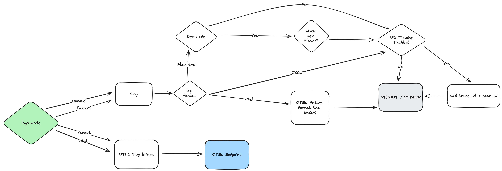

# LoggerGo

  [](https://pkg.go.dev/github.com/wasilak/loggergo) [](https://codeclimate.com/github/wasilak/loggergo/maintainability)

A lightweight, customizable logging library for Go, designed to provide flexible and simple logging capabilities.



## Features

- Simple API for various log levels (Info, Debug, Error).
- Customizable log formats and outputs.
- Lightweight and easy to integrate.
- Supports OTEL (OpenTelemetry) by injecting `spanID` & `traceID` into logs.
- By default registers as `slog.Default()` but this can be change via option

## Installation

To install LoggerGo, run:

```bash
go get github.com/wasilak/loggergo
```

## Usage

Here's a basic example of how to use LoggerGo:

https://github.com/wasilak/loggergo/blob/main/examples/simple/main.go

## Contributing

Contributions are welcome! Please fork the repository, make changes, and submit a pull request.

---

Feel free to adjust the example to better match the specific functionality of your library.
