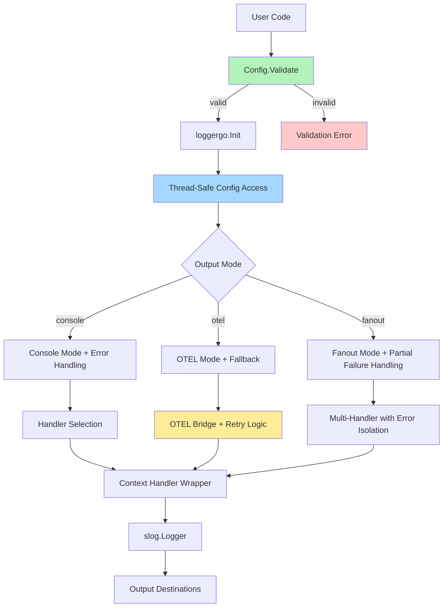

# LoggerGo

  [](https://pkg.go.dev/github.com/wasilak/loggergo) [](https://codeclimate.com/github/wasilak/loggergo/maintainability)

A lightweight, customizable logging library for Go, designed to provide flexible and production-ready logging capabilities with OpenTelemetry integration.

## Features

- 🚀 **Simple API** - Easy-to-use interface built on Go's standard `log/slog`
- 📊 **Multiple Output Modes** - Console, OpenTelemetry, or fanout to both
- 🎨 **Flexible Formats** - JSON, text, or OTEL format with dev-friendly flavors
- 🔍 **OpenTelemetry Integration** - Automatic trace ID and span ID injection
- 🧵 **Thread-Safe** - Safe for concurrent use across goroutines
- 🛡️ **Robust Error Handling** - Graceful degradation and comprehensive validation
- 📝 **Context-Aware** - Automatic extraction of values from context
- ⚡ **Dynamic Level Changes** - Adjust log levels at runtime
- ✅ **Production-Ready** - Extensively tested with property-based tests

## Architecture



## Installation

```bash
go get github.com/wasilak/loggergo
```

## Quick Start

```go
package main

import (
    "context"
    "log/slog"
    "github.com/wasilak/loggergo"
)

func main() {
    ctx := context.Background()
    
    // Minimal configuration
    config := loggergo.Config{
        Level: slog.LevelInfo,
    }
    
    ctx, logger, err := loggergo.Init(ctx, config)
    if err != nil {
        panic(err)
    }
    
    logger.Info("Hello, LoggerGo!")
    logger.Debug("This won't be logged (level is Info)")
    logger.Error("Something went wrong", "error", "example error")
}
```

## Common Usage Patterns

### Console Logging with JSON Format

```go
config := loggergo.Config{
    Level:  slog.LevelInfo,
    Format: loggergo.Types.LogFormatJSON,
    Output: loggergo.Types.OutputConsole,
}
ctx, logger, err := loggergo.Init(ctx, config)
```

### Development Mode with Pretty Output

```go
config := loggergo.Config{
    Level:     slog.LevelDebug,
    Format:    loggergo.Types.LogFormatText,
    Output:    loggergo.Types.OutputConsole,
    DevMode:   true,
    DevFlavor: loggergo.Types.DevFlavorTint, // or DevFlavorSlogor, DevFlavorDevslog
}
ctx, logger, err := loggergo.Init(ctx, config)
```

### OpenTelemetry Integration

```go
config := loggergo.Config{
    Level:              slog.LevelInfo,
    Output:             loggergo.Types.OutputOtel,
    OtelLoggerName:     "myapp/logger",
    OtelServiceName:    "myapp",
    OtelTracingEnabled: true,
}
ctx, logger, err := loggergo.Init(ctx, config)
// Logs will include trace_id and span_id when available
```

### Fanout Mode (Console + OTEL)

```go
config := loggergo.Config{
    Level:           slog.LevelInfo,
    Format:          loggergo.Types.LogFormatJSON,
    Output:          loggergo.Types.OutputFanout,
    OtelLoggerName:  "myapp/logger",
    OtelServiceName: "myapp",
}
ctx, logger, err := loggergo.Init(ctx, config)
// Logs go to both console and OTEL
```

### Context-Aware Logging

```go
type contextKey string
const requestIDKey contextKey = "request_id"

config := loggergo.Config{
    Level:              slog.LevelInfo,
    ContextKeys:        []interface{}{requestIDKey},
    ContextKeysDefault: "unknown",
}
ctx, logger, err := loggergo.Init(ctx, config)

// Add value to context
ctx = context.WithValue(ctx, requestIDKey, "req-123")

// This log will automatically include request_id: "req-123"
logger.InfoContext(ctx, "Processing request")
```

### Dynamic Log Level Changes

```go
ctx, logger, err := loggergo.Init(ctx, config)

// Get the level accessor
levelVar := loggergo.GetLogLevelAccessor()

// Change level at runtime (thread-safe)
levelVar.Set(slog.LevelDebug)
logger.Debug("Now this will be logged")

levelVar.Set(slog.LevelWarn)
logger.Info("This won't be logged anymore")
```

## Configuration Reference

| Field | Type | Default | Description |
|-------|------|---------|-------------|
| `Level` | `slog.Leveler` | `slog.LevelInfo` | Log level (Debug, Info, Warn, Error) |
| `Format` | `LogFormat` | `LogFormatJSON` | Output format (JSON, Text, OTEL) |
| `Output` | `OutputType` | `OutputConsole` | Output mode (Console, OTEL, Fanout) |
| `DevMode` | `bool` | `false` | Enable development mode with pretty output |
| `DevFlavor` | `DevFlavor` | `DevFlavorTint` | Dev format flavor (Tint, Slogor, Devslog) |
| `OutputStream` | `io.Writer` | `os.Stdout` | Output destination |
| `SetAsDefault` | `bool` | `true` | Register as `slog.Default()` |
| `OtelTracingEnabled` | `bool` | `true` | Enable OTEL tracing |
| `OtelLoggerName` | `string` | `"my/pkg/name"` | OTEL logger name (required for OTEL/Fanout) |
| `OtelServiceName` | `string` | `"my-service"` | OTEL service name (required for OTEL/Fanout) |
| `ContextKeys` | `[]interface{}` | `[]` | Keys to extract from context |
| `ContextKeysDefault` | `interface{}` | `nil` | Default value for missing context keys |

### Configuration Validation

All configurations are automatically validated before initialization:

```go
config := loggergo.Config{
    Level:  nil, // Invalid: Level cannot be nil
    Output: loggergo.Types.OutputOtel,
    // Missing: OtelLoggerName and OtelServiceName required for OTEL
}

ctx, logger, err := loggergo.Init(ctx, config)
if err != nil {
    // err will be *types.InitError with detailed validation failures
    fmt.Printf("Configuration error: %v\n", err)
}
```

## Troubleshooting

### Issue: OTEL initialization fails

**Symptom:** Warning message "OTEL initialization failed, falling back to console mode"

**Solution:** LoggerGo automatically falls back to console mode when OTEL setup fails. Check:
- OTEL endpoint is reachable
- `OtelLoggerName` and `OtelServiceName` are set correctly
- OTEL environment variables are configured

### Issue: Boolean fields not merging correctly

**Symptom:** Boolean config values (DevMode, SetAsDefault) unexpectedly change to false

**Solution:** When using partial config overrides, explicitly set all boolean fields:

```go
// ❌ Wrong: DevMode will be false (Go default)
override := loggergo.Config{Level: slog.LevelDebug}

// ✅ Correct: Explicitly preserve DevMode
override := loggergo.Config{
    Level:   slog.LevelDebug,
    DevMode: true, // Explicitly set
}
```

### Issue: Context values not appearing in logs

**Symptom:** Context keys configured but values don't appear in log output

**Solution:** Ensure you're using `*Context` methods:

```go
// ❌ Wrong: Context not passed
logger.Info("message")

// ✅ Correct: Context passed
logger.InfoContext(ctx, "message")
```

### Issue: Logs not appearing

**Symptom:** No log output

**Solution:** Check log level filtering:

```go
config := loggergo.Config{
    Level: slog.LevelWarn, // Only Warn and Error will be logged
}
logger.Info("This won't appear") // Info < Warn
logger.Error("This will appear") // Error >= Warn
```

## Migration Guide

### Migrating from v1.x to v2.0

#### Breaking Changes

1. **Configuration Validation**: Configs are now validated automatically. Invalid configs will return errors instead of panicking.

```go
// v1.x: Would panic on invalid config
ctx, logger, _ := loggergo.Init(ctx, invalidConfig)

// v2.0: Returns error
ctx, logger, err := loggergo.Init(ctx, invalidConfig)
if err != nil {
    // Handle validation error
}
```

2. **Error Types**: Init now returns `*types.InitError` with detailed context.

```go
// v2.0: Check error type
if err != nil {
    var initErr *types.InitError
    if errors.As(err, &initErr) {
        fmt.Printf("Failed at %s: %v\n", initErr.Stage, initErr.Cause)
    }
}
```

3. **Thread-Safe Config Access**: Use `GetConfig()` instead of accessing global variables.

```go
// v1.x: Direct access (not thread-safe)
// currentLevel := lib.libConfig.Level

// v2.0: Thread-safe accessor
config := loggergo.GetConfig()
currentLevel := config.Level
```

#### New Features in v2.0

- ✅ Automatic configuration validation
- ✅ Graceful OTEL fallback
- ✅ Thread-safe configuration management
- ✅ Comprehensive error handling
- ✅ Property-based testing
- ✅ Enhanced documentation

## Examples

See the [examples/](examples/) directory for complete working examples:

- [examples/simple/](examples/simple/) - Basic usage
- [examples/otel/](examples/otel/) - OpenTelemetry integration
- [examples/context/](examples/context/) - Context-aware logging
- [examples/advanced/](examples/advanced/) - Advanced configuration

## Migration Guide

### Migrating from v1.x to v2.x

Version 2.0 introduces several improvements while maintaining backward compatibility for most use cases. Here's what you need to know:

#### Breaking Changes

**1. Configuration Validation**

v2.0 introduces automatic configuration validation. Invalid configurations that previously failed silently or at runtime now fail early during initialization:

```go
// v1.x - Invalid config might fail later or behave unexpectedly
config := loggergo.Config{
    // Missing required Level field
    Output: types.OutputConsole,
}
ctx, logger, err := loggergo.Init(ctx, config)

// v2.x - Validation catches this immediately
config := loggergo.Config{
    // Missing required Level field
    Output: types.OutputConsole,
}
ctx, logger, err := loggergo.Init(ctx, config)
// err will be: "configuration validation failed: Level cannot be nil"
```

**Fix:** Ensure all required fields are set:

```go
config := loggergo.Config{
    Level:  slog.LevelInfo,  // Now required
    Output: types.OutputConsole,
}
```

**2. Deprecated Functions Moved**

Helper functions have been moved from `lib` package to `types` package:

```go
// v1.x
import "github.com/wasilak/loggergo/lib"

flavor := lib.DevFlavorFromString("tint")
level := lib.LogLevelFromString("info")
format := lib.LogFormatFromString("json")
output := lib.OutputTypeFromString("console")

// v2.x - Preferred approach
import "github.com/wasilak/loggergo/lib/types"

flavor := types.DevFlavorFromString("tint")
level := types.LogLevelFromString("info")
format := types.LogFormatFromString("json")
output := types.OutputTypeFromString("console")
```

**Note:** The old `lib.*FromString` functions still work but are deprecated and will be removed in v3.0.

**3. Error Handling Improvements**

Errors now include more context and are wrapped for better debugging:

```go
// v1.x - Generic error
err := loggergo.Init(ctx, config)
// err: "invalid configuration"

// v2.x - Detailed error with context
err := loggergo.Init(ctx, config)
// err: "logger initialization failed at validation: Level cannot be nil"

// You can unwrap to get the underlying error
var initErr *loggergo.InitError
if errors.As(err, &initErr) {
    fmt.Printf("Failed at stage: %s\n", initErr.Stage)
    fmt.Printf("Cause: %v\n", initErr.Cause)
}
```

#### New Features

**1. Configuration Validation Method**

You can now validate configuration before initialization:

```go
config := loggergo.Config{
    Level:  slog.LevelInfo,
    Output: types.OutputConsole,
}

// Validate before using
if err := config.Validate(); err != nil {
    log.Fatalf("Invalid config: %v", err)
}

ctx, logger, err := loggergo.Init(ctx, config)
```

**2. Thread-Safe Configuration Access**

Configuration is now protected by RWMutex for safe concurrent access:

```go
// Safe to call from multiple goroutines
currentConfig := loggergo.GetConfig()

// Safe to update from multiple goroutines
loggergo.SetConfig(newConfig)
```

**3. Graceful OTEL Degradation**

If OpenTelemetry initialization fails, the logger now falls back to console mode instead of failing completely:

```go
config := loggergo.Config{
    Level:  slog.LevelInfo,
    Output: types.OutputOtel,
    OtelServiceName: "my-service",
    // If OTEL endpoint is unreachable, falls back to console
}
```

**4. Enhanced Context Handling**

Context extraction is now more robust with nil-safety and better error handling:

```go
config := loggergo.Config{
    Level:       slog.LevelInfo,
    Output:      types.OutputConsole,
    ContextKeys: []interface{}{"request_id", "user_id"},
    ContextKeysDefault: "unknown",  // Used when key is missing
}

// Safe even with nil context
logger.InfoContext(nil, "message")  // Won't panic
```

#### Version Compatibility Matrix

| Version | Go Version | Status | Breaking Changes | Notes |
|---------|------------|--------|------------------|-------|
| v2.1.x  | 1.21+      | Current | None | Added migration guide |
| v2.0.x  | 1.21+      | Stable | Configuration validation, deprecated functions | Recommended for new projects |
| v1.x.x  | 1.20+      | Maintenance | N/A | Security fixes only |

#### Recommended Migration Steps

1. **Update imports** - Change `lib.*FromString` to `types.*FromString`
2. **Add validation** - Ensure all required config fields are set
3. **Test thoroughly** - Run `go test -race ./...` to catch any issues
4. **Update error handling** - Take advantage of new wrapped errors
5. **Review logs** - Check for deprecation warnings in your logs

#### Getting Help

If you encounter issues during migration:

1. Check the [examples/](examples/) directory for updated patterns
2. Review the [API documentation](https://pkg.go.dev/github.com/wasilak/loggergo)
3. Open an issue on [GitHub](https://github.com/wasilak/loggergo/issues)

## Contributing

Contributions are welcome! Please:

1. Fork the repository
2. Create a feature branch
3. Make your changes with tests
4. Run `go test ./...` and `go test -race ./...`
5. Submit a pull request

## License

See [LICENSE](LICENSE) file for details.

## Links

- [Documentation](https://pkg.go.dev/github.com/wasilak/loggergo)
- [GitHub Repository](https://github.com/wasilak/loggergo)
- [Issue Tracker](https://github.com/wasilak/loggergo/issues)
